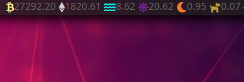

[XOOKX](https://github.com/XO490/xookx)
---

### [Monitoring your trading on OKX](https://okx.com)

[used okx api v5](https://www.okx.com/docs-v5/en/#market-maker-program)

### Build

```bash
git clone https://github.com/XO490/xookx
cd xookx
make build

cd bin
./xookx-l64 -h
Usage of ./xookx-l64:
  -config
    	create config.yaml file
  -custom-sound string
    	your custom sound notification: --custom-sound=btc.mp3 (use --sound OR --custom-sound)
  -index string
    	return 'last', see https://www.okx.com/docs-v5/en/#rest-api-market-data-get-index-components
  -sound
    	default sound notification: --sound (use --sound OR --custom-sound)
```

### Usage

```bash
./xookx-l64 --config
./xookx-l64 --index=BTC-USDT
27350.40
```

### Example of usage in polybar


### Warning
Use paid proxies, as okx blocks free proxies.

 
